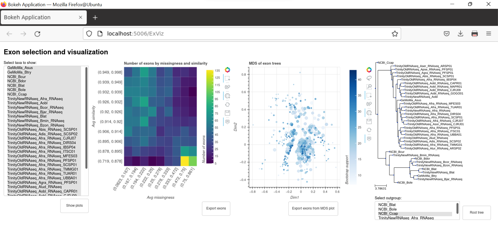

# HiMAP_v2


# Description

HiMAP2 is a tool designed to identify informative loci from diverse genomic and transcriptomic resources in a phylogenomic framework. Our intended use of this tool is to identify informative loci for phylogenetic studies, but it can also be used more widely for comparative genomic tasks. HiMAP2 builds on the original HiMAP pipeline [(Dupuis et al., 2018)]( https://onlinelibrary.wiley.com/doi/abs/10.1111/1755-0998.12783), which identified orthologous exon clusters from annotated transcriptome/genome assemblies. 

## Overview 
The program is divided into six steps:  
**Step0** `00_initialize_working_dir.py` This is a preprocessing step that aims to create the directory tree, which will be used for the next steps.  
**Step01** `01_sequence_extraction.py` This script takes the genomic and transcriptomic sequences along with their gff files as inputs to extract the set of coding sequences per sample.  
**Step02** `02a_orthofinder.py` and `02b_ortho_selection.py` These scripts infer a set of orthologs using Orthofinder v. 2.5.4 (Emms and Kelly, 2019) and extract cluster of orthologs according to set of parameters defined by the user. However other ortholog prediction approaches can also be used.  
**Step03** `03_alignments_and_filtering.py` This is the main locus selection pipeline, which takes as input ortholog prediction from a variety of genomic and transcriptomic resources (some of which with relatively trustworthy structural annotations: “high quality annotations”). Exon/intron boundaries from the “high quality annotations” are used to predict exon/intron boundaries across all data, and several filtering steps identify conserved exons across data inputs.  
**Step04** `04_exon_phylogeny.py` This script is intended to infer exon phylogenies following the steps: generates the alignment, determine the best-fit substitution model and reconstruct a maximum likelihood phylogeny.  
**Step05** `05_speciestree.py` This script performs species tree inference using exon trees generated by the `05_exon_phylogeny.py` script in Step04. Species tree inference is performed in ASTRAL v.5.7.8 (Mirarab et al., 2014, Zhang et al., 2018).  
**Step06** `HiMAP2_viz` Data visualization tool, which allows the user to analyze missingness and informativeness of the provided datasets and explore the tree space of exon phylogenies. ExView is an interactive Bokeh application included in the HiMAP2 conda environment. 


## Installation
#### Requirements
Conda installer (e.g. Anaconda, Miniconda, Mamba)  
Python >=3.7.1 is required.
#### Download this git repo
Either use git:
```
git clone https://github.com/popphylotools/HiMAP_v2.git
mv HiMAP_v2 HiMAP2
find HiMAP2 -type f \( -name "*.py" -o -name "*.sh" \) -exec chmod +x {} \;
cd HiMAP2
#Alternatively, change permissions for the HiMAP2 directory and all its content
#chmod -R +x HiMAP2
```
or curl:
```
curl -L "https://github.com/popphylotools/HiMAP_v2/archive/main.zip" -o HiMAP_v2.zip
unzip HiMAP_v2.zip
mv HiMAP_v2-main HiMAP2
find HiMAP2 -type f \( -name "*.py" -o -name "*.sh" \) -exec chmod +x {} \;
cd HiMAP2
#Alternatively, change permissions for the HiMAP2 directory and all its content
#chmod -R +x HiMAP2
```

#### Create Anaconda environments
osx and linux:
```
./create_anaconda_environments.sh
```

#### Download Data
We have included a toy dataset in this GitHub repo [here](https://github.com/popphylotools/HiMAP_v2/tree/main/toy_data), which will allow a user to proceed through all parts of this pipeline. This toy dataset includes abbreviated inputs for all parts of the pipeline, to decrease processing time and make it easier to test all steps. Toy data include input fasta and gff files for ten species assigned to core, supplemental, and outgroup lists (see below) in the provided configuration file. These sample data are produced by three widely used genome annotation tools (Trinity, GeMoMa, NCBI) to illustrate input requirements for data from different sources. 

## Usage: Quick and Dirty
Configure data paths and parameters by editing config.ini. As configured, it will run with the example data linked above. Old output of each step is deleted before new output files are written. 

Activate main HiMAP env with:
```
conda activate himap2
```
Run the desired script located in the bin directory, e.g.:
```
[Himap2_path]/bin/00_initialize_working_dir.py
```

## Usage: Detailed
The file `config.ini` contains various parameters and data paths for running all five parts of this pipeline. Notably, this includes 3 lists of species names (spelled as in the input fasta and gff files): core species, supplemental species, and outgroup species.  
**Core species** includes those with “high quality annotations” and will be used to predict exon/intron boundaries for the remaining species.  
**Supplemental species** include those with “lower quality” annotations, which will add data to the analysis, but not necessarily limit exon prediction due to lower quality.  
**Outgroup species** include highly divergent data for the group in question. These will not impact exon selection, but outgroup data will be added when possible.  

This config file also contains paths to the various inputs/intermediate/outputs for each part. If using all steps of this pipeline, we suggest using 00_initialize_working_dir.py, which generates all necessary directories as in the following directory tree (these directories):
```
|-- data
|   |-- 00_fasta
|   |-- 00_gff
|   |-- 01_gff_db
|   |-- 01_simple_gff
|   |-- 01_pep_fasta
|   |-- 01_nuc_fasta
|   |-- 02_orthofinder
|   |-- 03a_core_alignment
|   |-- 03b_supplementary_alignment
|   |-- 03c_final_exons
|   |-- 04_exon_phylogeny
|   |-- 05_speciestree
```

Then the user should add genome or transcriptome assemblies to `00_fasta` and their corresponding gff files to `00_gff`. The files must be labelled as sample_name.fasta and  sample_name.gff, the species_name must match the names in the config.ini  file.

#### Step01
The `01_sequence_extraction.py` script takes assemblies in fasta format and extracts coding sequences using the information from gff annotation files. Here is an example of the gff file (for more information check https://uswest.ensembl.org/info/website/upload/gff3.html):
```
NW_011863665.1	Gnomon	mRNA	101560	103308	.	+	.	ID=rna15;Parent=gene5;Dbxref=GeneID:105210509,Genbank:XM_011181522.1;Name=XM_011181522.1;gbkey=mRNA;gene=LOC105210509;model_evidence=Supporting	evidence	includes	similarity	to:	1	Protein%2C	and	32%25	coverage	of	the	annotated	genomic	feature	by	RNAseq	alignments;product=uncharacterized	LOC105210509;transcript_id=XM_011181522.1
NW_011863665.1	Gnomon	exon	101560	103223	.	+	.	ID=id114;Parent=rna15;Dbxref=GeneID:105210509,Genbank:XM_011181522.1;gbkey=mRNA;gene=LOC105210509;product=uncharacterized	LOC105210509;transcript_id=XM_011181522.1
NW_011863665.1	Gnomon	exon	103300	103308	.	+	.	ID=id115;Parent=rna15;Dbxref=GeneID:105210509,Genbank:XM_011181522.1;gbkey=mRNA;gene=LOC105210509;product=uncharacterized	LOC105210509;transcript_id=XM_011181522.1
NW_011863665.1	Gnomon	CDS	101580	103223	.	+	0	ID=cds14;Parent=rna15;Dbxref=GeneID:105210509,Genbank:XP_011179824.1;Name=XP_011179824.1;gbkey=CDS;gene=LOC105210509;product=uncharacterized	protein	LOC105210509;protein_id=XP_011179824.1
NW_011863665.1	Gnomon	CDS	103300	103308	.	+	0	ID=cds14;Parent=rna15;Dbxref=GeneID:105210509,Genbank:XP_011179824.1;Name=XP_011179824.1;gbkey=CDS;gene=LOC105210509;product=uncharacterized	protein	LOC105210509;protein_id=XP_011179824.1
```
The output of this step is a set of coding sequences and peptides per sample, which are saved to `01_nuc_fasta` and `01_pep_fasta` directories, respectively.

#### Step02
This part is subdivided into two steps. First, the `02a_orthofinder.py` script uses OrthoFinder v2.5.4 to conduct ortholog prediction. This script generates a folder named `Orthofinder` and a file named `Orthogroups.tsv`. The folder contains all the results produced by Orthofinder. The second step is performed by `02b_ortho_selection.py` script, which performs ortholog filtering using the parameters set in the config file. The result will be saved in a csv file named  `keep_orthos.csv`, which looks like:
```
ortho,GeMoMa_Asus,GeMoMa_Btry,NCBI_Bcur,NCBI_Bdor,NCBI_Blat,NCBI_Bole,NCBI_Ccap,NCBI_Dmel,NCBI_Dsuz_v01,NCBI_Rzep
OG0000508,TR13709|C0_G1_I1|M.8988_R0,TR68478|C0_G1_I1|M.57794_R0,rna18076,rna3850,rna22300,rna4121,,rna-NM_143011.3,rna12420,rna8504
OG0000640,TR43271|C1_G1_I1|M.29531_R0,,rna2822,rna8134,rna328,rna16123,rna10333,rna-NM_001275011.2,rna21577,rna24907
```
In this example, there is a header consisting of “ortho” following by the name of each sample. The following rows contain one ortholog group per row with the ortholog id (OG0000508) and the coding sequence name of each sample. In case of missing a gene, that entry will be empty.

#### Step03
The output of the `03_alignments_and_filtering.py` script is multi-FASTA formatted conserved exons, and these files are named with the ortholog ID followed by position coordinates for that exon, e.g., `OG0006517_0-134.fasta`. These coordinates refer to positions in the “padded exons” (before orthologs are split up into multiple exons, see [Dupuis et al. (2018)](https://onlinelibrary.wiley.com/doi/abs/10.1111/1755-0998.12783) for a more detailed description).

#### Step04
The `04_exon_phylogeny.py` script aligns exons using mafft v7.487 [(Katoh and Standley, 2013)](https://academic.oup.com/mbe/article/30/4/772/1073398), determine the best-fit substitution model using modeltest NG [(Darriba et al., 2020)]( https://academic.oup.com/mbe/article/37/1/291/5552155) and reconstruct a maximum likelihood phylogeny using RAxML-NG v0.9.0 [(Kozlov et al., 2019)]( https://academic.oup.com/bioinformatics/article/35/21/4453/5487384).

#### Step05
The `05_speciestree.py` script infers a species tree using ASTRAL v.5.7.8 (Mirarab et al., 2014, Zhang et al., 2018). Required input for this step are exon trees generated in Step05. ASTRAL is not included with the HiMAP2 package and should be install separately. The main output from this step is the `speciestree_quartetsupport.tre` file containing species tree with quartet branch support values. 

#### Step06
The visualization part of the pipeline is presented as an interactive Bokeh application run via bokeh server. Visualization interface contains three plot panels including heatmap, MDS plot, and phylogenetic tree view. The application is initiated by running:
```
bokeh serve --show HiMAP2_viz 
``` 
Visualization application requires final filtered exons (Step03 output) as its minimum input. This will generate a heatmap showing distribution of exon alignments by the amount of missing taxa and sequence similarity. The multiselect taxon panel allows users to pick a subset of taxa to generate a heatmap of the exon alignments. If exon phylogenies from Step04 are available, visualization app can also produce a multidimensional scaling (MDS) plot for the selected groups of exons in the heatmap. Individual exon tree points in the MDS plot are colored according to the average bootstrap support of that exon tree while diameter of the point is scaled relative to the number of taxa in the exon alignment. When groups or individual exon tree points are selected in the MDS plot, a species tree is infered from the selected exon trees and displayed in the right-most tree view panel. Species tree can then be rooted to a user specified taxon or group of taxa using the multiselect tool below the tree view panel. For the exons selected in the heatmap and/or MDS plot, summary information as well as fasta files can be exported using the export buttons below corresponding plots.


## Uninstall
If needed, remove Anaconda environments
```
conda env remove --name himap2
```

## Credits
[Oksana Vernygora](https://github.com/OksanaVe): Contributor  
[Carlos Congrains](https://github.com/carloscongrains): Contributor  
[Forest Bremer](https://github.com/fbremer): Legacy contributor  
[Julian Dupuis](https://github.com/jrdupuis): Contributor  
[Scott Geib](https://github.com/scottgeib): Contributor  
